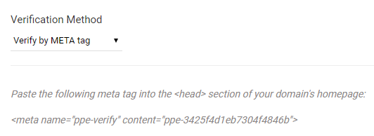

After sign up, you will receive a separate welcome email which contains a link to activate your EhloMail Security account and select a password. Please make sure you save these credentials as you will need them moving forwards. 

1. Login to [EhloMail Security Dashboard](https://eu1.proofpointessentials.com/app/login.php?eid=10109) with the new email and password
2. Navigate to **ADMINISTRATION** > **Account Management** > **Domains** 

##Verify the domain 

Before enabling the inbound and outbound protection on your domain, you first have to prove you have control over this domain. There will be a quick validation test (similar to how domain validation for SSL certificates is performed) which you will need to pass before the service can be activated. 

Your domain will already be added to the dashboard, ready to be verified. 

3. Click on the domain name or on the Edit icon to open the domain settings page

4. Navigate to the bottom of the page 
5. Select the preferred validation method between DNS Record or META Tag. See further instructions for each case below:

### Verify using DNS (TXT) record: 

When selecting this option, a TXT value will be displayed.

1. Copy the value to the clipboard.
2. Click Verify Later.
3. Open a new tab or browser window.
4. Login to your DNS provider's website.
5. Go to the domain management screen: this may be called DNS Settings, Control Panel, Advanced Settings, etc.
6. Add a new entry to your DNS as follows:
* Type = TXT
* Host = @
* Value/Answer/Definition = Paste value from the clipboard
* TTL = 3600 seconds / 1 hour
8. Save the changes.
9. Return to EhloMail Security. Your domain should now show **Verification status -Pending**
10. Click on the domain name and **Verify Now**.
11. Confirm that the verification status value associated with the domain is verified (as shown in the Verification Status column for the domain on the Domains tab of Company Settings).

Please note that DNS changes might take a few minutes to propagate so the verification might not be successful instantly. 

### Verify using META Tag

From the **Verification Method** box, choose "Verify by META tag record". A META value will display like this:

1. Copy the value to the clipboard.
2. Click Verify Later.
3. Open a new tab or browser window
4. Open your website homepage HTML file using any text or HTML editor or a web-based page editor (like WordPress for example).
5. Paste the content from your clipboard into the <head> section that appears before the first <body> section. 
6. Open your website homepage in a browser and view the source to confirm the addition.
7. Return to EhloMail Security.
8. Edit the domain you wish to verify and click **Verify Now**.

Confirm that the verification status value associated with the domain is verified (as shown in the Verification Status column for the domain on the Domains tab of Company Settings).
    
You can also test the domain to see if it's been properly verified & configured 

  
## Enable inbound and outbound protection
 
The only step left is to enable the **Relay** option which protects your inbound emails from spam and scans any outbound emails for viruses, to ensure your account doesn't get compromised and that you are not sending emails containing any malware by accident. 
    
To do this, simply toggle the relay button ON as shown in the screenshot below.

