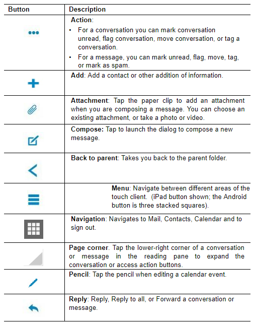

The EhloMail Touch Client application is used on touch-capable mobile devices. Its features are a subset of the features found in the EhloMail Web Client, including Mail, Contacts, and Calendar.

### Supported Devices

Supported devices for the EhloMail Touch Client include:
iOS6+: iPad®, iPad mini®, iPhone®, iPod touch®
Android 4.0+: Nexus 7, Nexus 10, Samsung Galaxy Tab™, Samsung Galaxy S® III, Samsung Galaxy S® 4, Galaxy Nexus™

### Logging In
To access the touch client, enter the URL for the EhloMail Web Client https://mail.ls and the touch client is automatically detected. Enter your Username and Password, and tap Sign In.

### Signing Out
You can sign out of the touch client using the menu in the tool bar. Tap Sign Out. Once you are signed out, you are redirected to the log-in screen.

### General Functionality
General functionality of the touch client includes the different layouts you will see when using a tablet or mobile device, switching applications (such as going from Mail to Contacts), and using search. When viewing items within Mail or Contacts, there is a list panel and a reading pane. Calendar uses a single panel to show a day or a month. The layout you see when using Mail or Contacts depends on the device and its orientation.

#### Using a Tablet

**Landscape View**: A tablet in landscape orientation displays both panels, with the list panel on the left and reading pane on the right. The list panel remains visible while you are viewing a conversation or a contact.

**Portrait View**: When a tablet is in portrait orientation, the list panel is superimposed over the reading pane, and slides back when an item is viewed. Tapping the <Inbox. button on the toolbar brings the list back into view.

#### Using a Mobile Phone
A mobile phone only displays one panel regardless of its orientation. When an item is viewed, its panel fills the display. Tapping the <Inbox. button on the toolbar brings the list back into view.
                                                                                                                                              
### Button Functionality

